# UNO 项目架构文档

## 1. 项目概述

### 1.1 简介
UNO (Uno Numerical Optimization) 是一个模块化、可扩展的非线性优化求解器框架。它支持多种优化算法，包括内点法、SQP方法、信赖域方法等，能够处理约束和无约束优化问题。

### 1.2 主要特性
- **模块化设计**：各组件独立可替换
- **多算法支持**：内点法、滤波器方法、信赖域等
- **灵活的线性求解器**：支持 MUMPS、MA27/MA57、Eigen 等
- **高级特性**：正则化、惯性修正、线搜索、滤波器
- **AMPL 接口**：支持标准优化建模语言

### 1.3 设计理念
- **可组合性**：通过"ingredients"（配料）概念组合不同算法组件
- **可扩展性**：易于添加新的求解器和算法
- **数值鲁棒性**：多种数值稳定化技术

## 2. 系统架构

### 2.1 整体架构图

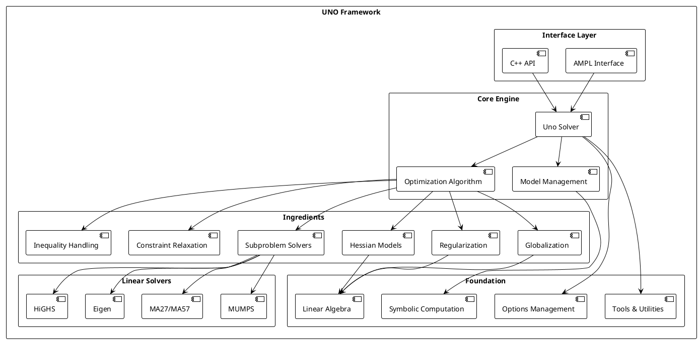

### 2.2 层次结构

```
┌─────────────────────────────────────────┐
│          Interface Layer                │
│     (AMPL, C++ API, Python绑定)        │
├─────────────────────────────────────────┤
│          Core Optimization              │
│    (Uno, OptimizationAlgorithm)        │
├─────────────────────────────────────────┤
│          Algorithm Components           │
│         (Ingredients层)                 │
├─────────────────────────────────────────┤
│          Mathematical Foundation        │
│    (线性代数, 符号计算, 工具)          │
├─────────────────────────────────────────┤
│          External Solvers              │
│     (MUMPS, HSL, Eigen, HiGHS)        │
└─────────────────────────────────────────┘
```

## 3. 核心组件

### 3.1 主要模块详解

#### 3.1.1 Model（模型管理）
负责优化问题的表示和管理：

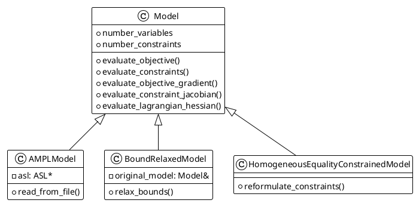

#### 3.1.2 Ingredients（算法组件）

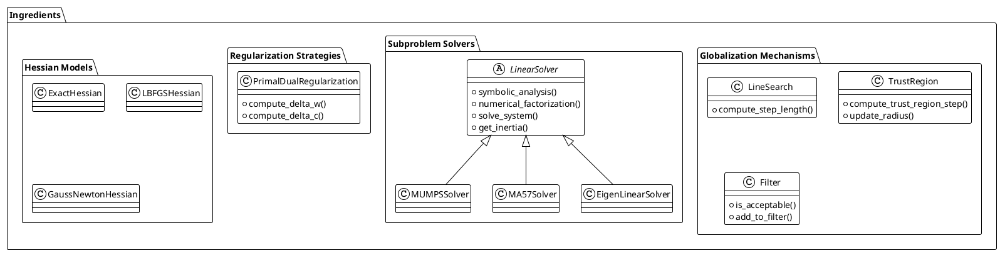

### 3.2 求解器工厂模式

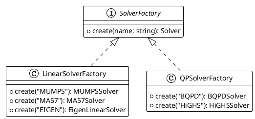

## 4. 计算工作流

### 4.1 主要优化循环

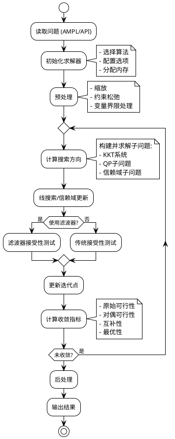

### 4.2 子问题求解流程

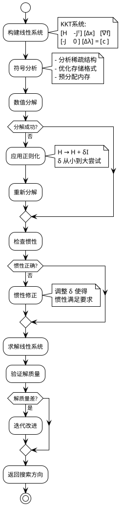

## 5. 数据流与控制流

### 5.1 数据流图

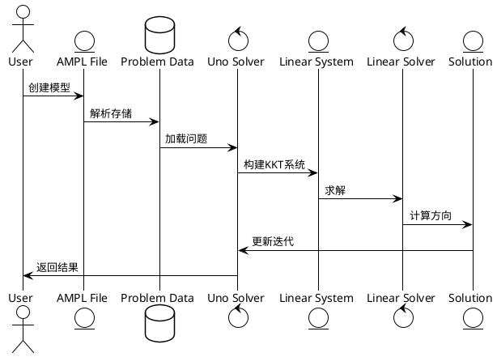

### 5.2 控制流状态机

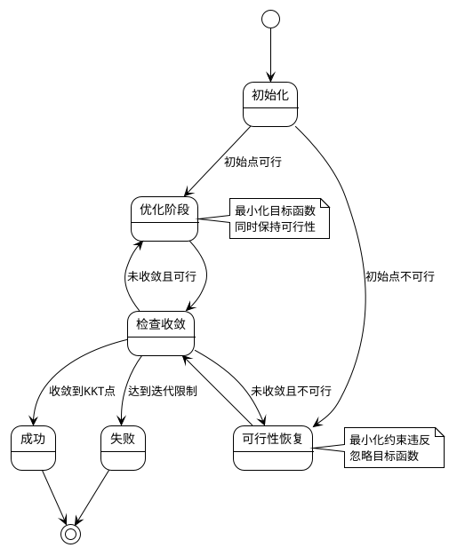

## 6. 关键算法实现

### 6.1 内点法 (Interior Point Method)

#### 算法流程
```python
# 伪代码
def interior_point_method(problem):
    x, s, λ, z = initialize_variables()
    μ = initial_barrier_parameter

    while not converged:
        # 构建 KKT 系统
        KKT = build_kkt_system(x, s, λ, z, μ)

        # 求解搜索方向
        Δx, Δs, Δλ, Δz = solve_kkt_system(KKT)

        # 线搜索
        α = line_search(x, s, Δx, Δs)

        # 更新变量
        x += α * Δx
        s += α * Δs
        λ += α * Δλ
        z += α * Δz

        # 更新障碍参数
        μ = update_barrier_parameter(μ)

    return x
```

#### KKT 系统结构
```
┌                                    ┐ ┌    ┐   ┌      ┐
│  H + Σ    0     -Jᵀ    -I        │ │ Δx │   │  -∇L  │
│   0       Z     0      S         │ │ Δs │ = │  -rc  │
│  -J       0     0      0         │ │ Δλ │   │   c   │
│  -I       I     0      0         │ │ Δz │   │  x-s  │
└                                    ┘ └    ┘   └      ┘
```

### 6.2 信赖域方法 (Trust Region Method)

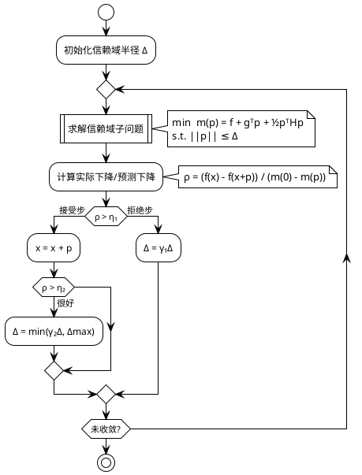

### 6.3 滤波器机制 (Filter Mechanism)

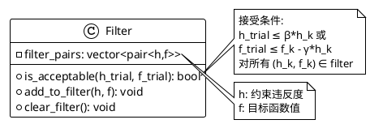

### 6.4 惯性修正算法

```python
# 伪代码
def inertia_correction(H, target_inertia):
    """
    修正 Hessian 矩阵的惯性
    目标：n_pos = n, n_neg = 0, n_zero = 0 (凸化)
    """
    δ = δ_min

    while δ < δ_max:
        # 尝试分解 H + δI
        factorize(H + δ * I)
        inertia = get_inertia()

        if inertia == target_inertia:
            return δ

        # 调整 δ
        if inertia.n_neg > 0:
            δ *= 10  # 需要更大的正则化
        else:
            break

    return δ
```

## 7. 性能优化策略

### 7.1 稀疏矩阵处理

- **COO 格式**：用于构建和修改
- **CSR/CSC 格式**：用于矩阵运算
- **符号分析**：预先分析稀疏结构，重用于多次分解

### 7.2 内存管理

- **预分配策略**：避免动态分配
- **工作空间重用**：迭代间重用临时空间
- **延迟计算**：只在需要时计算 Hessian

### 7.3 数值稳定性

- **缩放技术**：平衡矩阵条件数
- **主元选择**：1×1 和 2×2 主元块
- **迭代改进**：提高解的精度

## 8. 扩展机制

### 8.1 添加新的线性求解器

```cpp
class NewSolver : public DirectSymmetricIndefiniteLinearSolver {
public:
    void do_symbolic_analysis() override;
    void do_numerical_factorization(const double* values) override;
    void solve_system(const Vector& rhs, Vector& solution) override;
    Inertia get_inertia() const override;
};
```

### 8.2 添加新的优化算法

```cpp
class NewAlgorithm : public OptimizationAlgorithm {
public:
    void initialize(const Problem& problem) override;
    Direction compute_direction(const Iterate& current) override;
    void update_iterate(Iterate& current, const Direction& d) override;
};
```

### 8.3 插件系统

通过工厂模式注册新组件：
```cpp
LinearSolverFactory::register("NEW_SOLVER",
    []() { return std::make_unique<NewSolver>(); });
```

## 9. 配置系统

### 9.1 选项层次

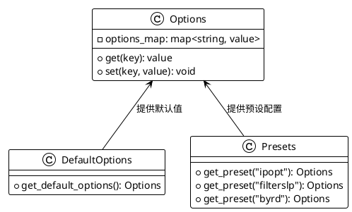

### 9.2 关键配置参数

| 参数类别 | 参数名 | 说明 |
|---------|--------|------|
| 线性求解器 | `linear_solver` | MUMPS, MA27, MA57, EIGEN |
| 全局化策略 | `globalization_strategy` | line_search, trust_region |
| 正则化策略 | `regularization_strategy` | none, primal, primal_dual |
| Hessian模型 | `hessian_model` | exact, LBFGS, gauss_newton |
| QP求解器 | `QP_solver` | BQPD, HiGHS |
| 收敛容差 | `tolerance` | 默认 1e-8 |

## 10. 总结

### 10.1 架构特点

1. **高度模块化**：各组件通过接口解耦，易于替换和扩展
2. **灵活组合**：通过 ingredients 机制组合不同算法组件
3. **数值鲁棒**：多层次的数值稳定化策略
4. **性能优化**：稀疏矩阵、内存重用、并行化支持

### 10.2 适用场景

- 大规模非线性优化问题
- 约束优化问题（等式和不等式约束）
- 需要高度定制化的优化应用
- 研究和教学用途

### 10.3 未来发展

- GPU 加速支持
- 分布式计算能力
- 更多的机器学习集成
- 自动微分支持